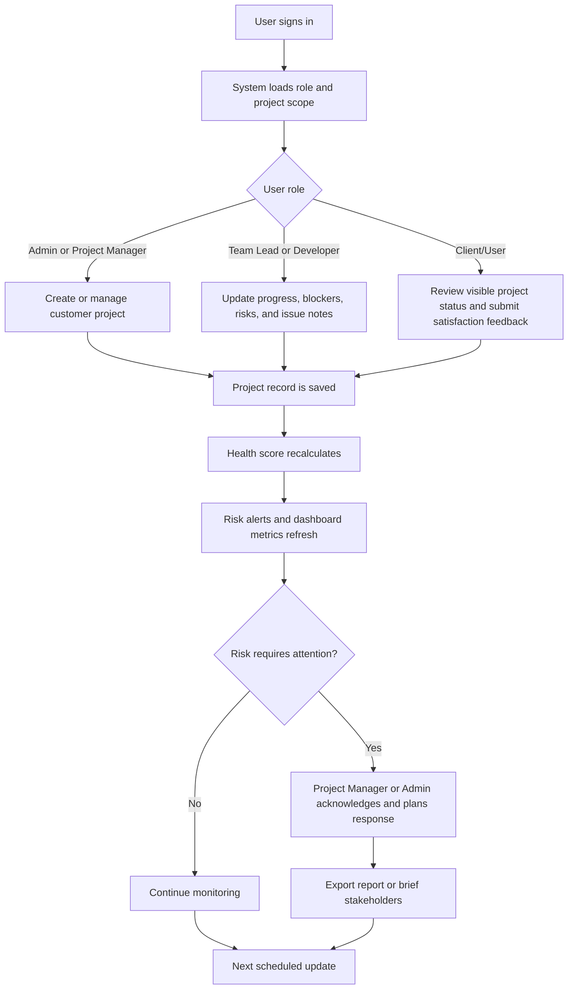
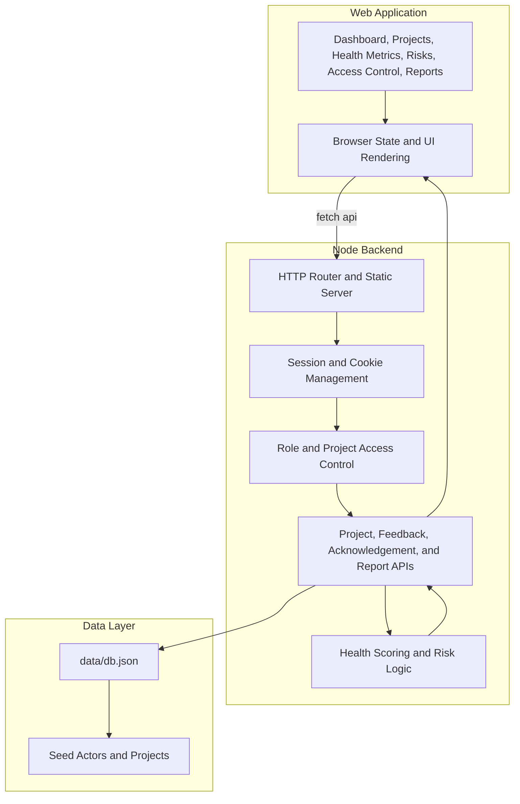
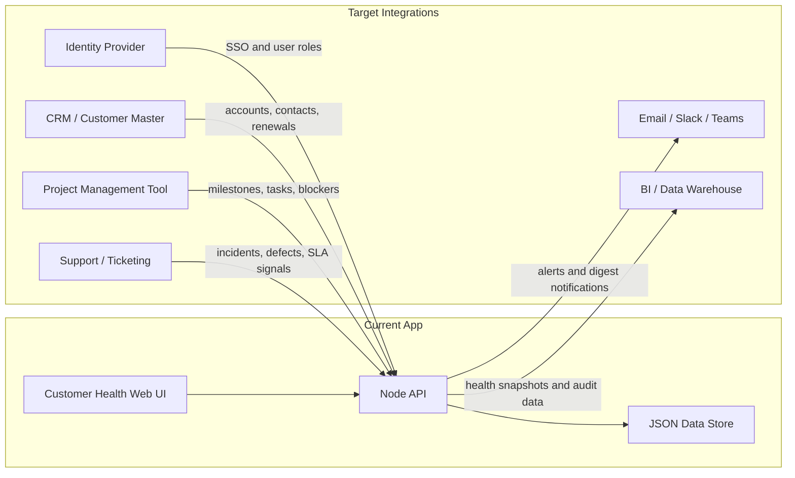
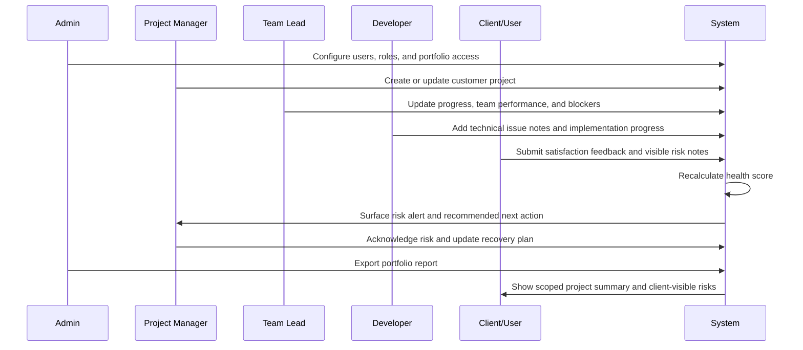
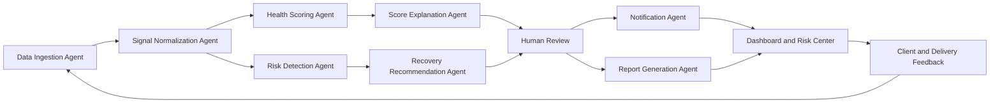

# Customer Health Discovery Phase Artifacts

This artifact pack captures the discovery and solution design baseline for the Customer Health project. It is intended to be reviewed during Discovery, refined with stakeholders, and used as the input for implementation planning.

## Artifact Register

| Artifact | Purpose | Discovery Output |
| --- | --- | --- |
| Business Canvas | Align business problem, value, users, and success metrics. | Shared view of why Customer Health exists and how value is measured. |
| Process Flow | Map the core end-to-end operating process. | Intake-to-escalation workflow for customer project health monitoring. |
| Functional Architecture Diagram | Define major application capabilities and boundaries. | Logical architecture for UI, API, roles, health scoring, alerts, and reporting. |
| Integration Diagram | Show internal and external system touchpoints. | Current and target integrations across identity, delivery tools, CRM, support, and analytics. |
| Swimlane Diagram | Clarify responsibilities across roles. | Role-based workflow across Admin, Project Manager, Team Lead, Developer, Client/User, and System. |
| Application Design | Describe screens, modules, data objects, and role behavior. | Product design baseline for the current app and near-term enhancements. |
| PRD | Convert discovery findings into product requirements. | Goals, users, requirements, acceptance criteria, constraints, and rollout plan. |
| Agent Graph | Define AI-assisted monitoring agents and human review loops. | Agent workflow for ingestion, scoring, risk detection, recommendations, and reporting. |

## 1. Business Canvas

| Area | Discovery Notes |
| --- | --- |
| Business problem | Delivery leaders need an early-warning system for customer project health, escalation risk, and role-based project visibility. Today, risk signals can be scattered across project updates, client feedback, technical blockers, and manager status reports. |
| Target users | Admins, Project Managers, Team Leads, Developers, and Client/Users. |
| Current customer examples | Signal, REI Blackbook, and Cafe Zupas are represented as seeded customer delivery records. |
| Value proposition | Provide one governed workspace for project health, weighted health scoring, risk alerts, client feedback, accountable ownership, and exportable delivery reporting. |
| Key workflows | Login and role scoping, project creation, project health updates, client satisfaction feedback, risk acknowledgement, portfolio dashboarding, and report export. |
| Differentiators | Health score combines progress, team performance, client satisfaction, delivery confidence, and explicit risk level penalties. Visibility is scoped by actor role and assigned project. |
| Success metrics | Reduced unresolved escalations, faster risk acknowledgement, improved delivery confidence, increased client satisfaction, on-time milestone recovery, and adoption by project roles. |
| Business constraints | Customer data must be access controlled. Client users should see only client-facing risk details. Delivery teams need low-friction updates rather than a heavy project management tool. |
| Assumptions | Project health can be improved when risk signals are visible early, assigned to accountable owners, and translated into next actions. |
| Open discovery questions | Which upstream tools are the source of truth for projects, tasks, support tickets, and client sentiment? Which score thresholds trigger required escalation? What audit trail is required for regulated customers? |

## 2. Process Flow



### Process Notes

1. Access is role-based and project-scoped before any project data is shown.
2. Project updates can change progress, status, risk level, team performance, client satisfaction, and delivery confidence.
3. Client feedback can add client-visible risk context and influence the health score.
4. Risk acknowledgement is limited to Admin and Project Manager roles.
5. Reports are generated from the current scoped application state.

## 3. Functional Architecture Diagram



### Functional Capabilities

| Capability | Current Baseline |
| --- | --- |
| Authentication | Local login and registration through backend API. |
| Authorization | Role and project assignment checks for viewing, editing, creating, acknowledging, and exporting. |
| Project health management | Project create/update, customer profile, progress, status, risk level, issue notes, and next actions. |
| Client feedback | Client/User satisfaction and client-visible risk feedback. |
| Health scoring | Weighted score using progress, team performance, client satisfaction, delivery confidence, and risk penalty. |
| Risk center | Filters and alerts for projects requiring attention. |
| Reporting | Scoped export endpoint and in-app forecast/report views. |
| Deployment | Node server with production/staging environment examples and static build support. |

## 4. Integration Diagram



### Integration Scope

| Integration | Direction | Discovery Decision Needed |
| --- | --- | --- |
| Identity provider | Inbound | Confirm SSO provider, role claims, session duration, and group-to-role mapping. |
| CRM/customer master | Inbound | Confirm source of customer accounts, renewal dates, account owners, and contract metadata. |
| Project management | Inbound | Confirm source for milestones, tasks, blockers, sprint progress, and ownership. |
| Support/ticketing | Inbound | Confirm incident severity, SLA status, defects, and support response time fields. |
| Communications | Outbound | Confirm alert channels, escalation recipients, digest cadence, and opt-out rules. |
| BI/data warehouse | Outbound | Confirm reporting granularity, retention, audit requirements, and schema ownership. |

## 5. Swimlane Diagram



### Role Responsibilities

| Role | Responsibilities |
| --- | --- |
| Admin | Own system configuration, access, governance, portfolio reporting, and executive visibility. |
| Project Manager | Own customer delivery health, risk response, stakeholder updates, timeline, and forecast. |
| Team Lead | Update team progress, delivery blockers, implementation risks, and technical readiness. |
| Developer | Update assigned implementation progress and add issue notes. |
| Client/User | Review project summary, timeline, client-visible risks, and submit satisfaction feedback. |
| System | Enforce access, calculate health, surface alerts, refresh dashboards, and prepare reports. |

## 6. Application Design

### Information Architecture

| Area | Design Intent |
| --- | --- |
| Login and registration | Authenticate users and assign scoped access to the selected project. |
| Dashboard | Provide portfolio-level health, risk, delivery, activity, and prediction summaries. |
| Projects | List customer records with filtering, selected profile details, and create/update workflows. |
| Health Metrics | Explain score drivers for the selected project. |
| Risk Alerts | Highlight projects needing attention and enable acknowledgement where permitted. |
| Access Control | Show actors, responsibilities, and role permissions. |
| Reports | Provide delivery forecast, status summaries, brief lists, and export action. |
| Proposal | Explain escalation prevention drivers and workflow-specific risk signals. |

### Data Model

| Object | Key Fields |
| --- | --- |
| Actor | id, email, password, name, role, organization, projectIds, accessLevel, responsibilities. |
| Project | id, name, customer, status, health, progress, teamPerformance, clientSatisfaction, deliveryConfidence, riskLevel, environment, portfolioShare. |
| Timeline | start, milestone, delivery. |
| Ownership | projectManager, teamLead, developers, clientUser. |
| Risk model | risks, clientRisks, issues, nextActions, healthTrend, lastUpdated. |
| Acknowledgement | actor id mapped to acknowledged project ids. |
| Session | token mapped to actor id and expiration. |

### Health Score Design

The current scoring formula:

```text
health =
  progress * 0.28
  + teamPerformance * 0.24
  + clientSatisfaction * 0.22
  + deliveryConfidence * 0.26
  - riskPenalty
```

Risk penalty:

| Risk Level | Penalty |
| --- | --- |
| Contained | 0 |
| Elevated | 6 |
| Critical | 12 |

### Role-Based Behavior

| Action | Admin | Project Manager | Team Lead | Developer | Client/User |
| --- | --- | --- | --- | --- | --- |
| View all projects | Yes | Assigned only | Assigned only | Assigned only | Own project only |
| Create project | Yes | Yes | No | No | No |
| Edit project health | Yes | Assigned only | Assigned only | Assigned only | No |
| Submit satisfaction feedback | No | No | No | No | Own project only |
| Acknowledge risks | Yes | Assigned only | No | No | No |
| Export reports | Yes | Assigned only | Assigned only where allowed | No | No |

## 7. Product Requirements Document

### Product Summary

Customer Health is a role-based web application for monitoring customer delivery health, detecting escalation risk, and coordinating recovery actions across delivery, engineering, and client stakeholders.

### Goals

1. Provide a single source of visibility for customer project health.
2. Detect delivery and satisfaction risks before they become escalations.
3. Give each role only the records and actions they are allowed to access.
4. Translate risk signals into accountable actions and exportable reporting.
5. Establish a foundation for AI-assisted project health monitoring.

### Non-Goals

1. Replace the system of record for project plans or support tickets in the first release.
2. Automate irreversible escalation decisions without human review.
3. Expose internal engineering notes directly to client users.
4. Implement full enterprise SSO, data warehouse sync, or CRM sync before integration discovery is complete.

### Personas

| Persona | Need |
| --- | --- |
| Executive/Admin | Portfolio visibility, governance, access control, and exportable reports. |
| Project Manager | Current project health, risks, client sentiment, ownership, and next actions. |
| Team Lead | Clear view of blockers, team performance, and delivery confidence. |
| Developer | Simple workflow to add progress and issue notes. |
| Client/User | Trusted view of project status and a feedback channel for visible concerns. |

### Functional Requirements

| ID | Requirement | Priority |
| --- | --- | --- |
| FR-01 | Users can log in and receive role-scoped application state. | Must |
| FR-02 | Admins and Project Managers can create customer project records. | Must |
| FR-03 | Authorized delivery users can update project status, risk level, progress, team performance, delivery confidence, and issue notes. | Must |
| FR-04 | Client/Users can submit satisfaction feedback for their own project. | Must |
| FR-05 | The system recalculates project health after project updates and client feedback. | Must |
| FR-06 | The dashboard shows portfolio metrics, visible health, elevated risks, delivery confidence, and activity. | Must |
| FR-07 | Risk alerts show projects requiring attention and allow authorized acknowledgement. | Must |
| FR-08 | Access control views show role definitions, actors, permissions, and responsibilities. | Should |
| FR-09 | Users with export permission can prepare delivery reports for their scoped project set. | Should |
| FR-10 | The system can later ingest project, support, CRM, and communication signals from external integrations. | Should |
| FR-11 | The system can generate AI-assisted risk summaries and next action recommendations with human review. | Could |

### Non-Functional Requirements

| ID | Requirement |
| --- | --- |
| NFR-01 | Access control must prevent users from viewing or changing unassigned project data. |
| NFR-02 | Session handling must use secure cookies in production. |
| NFR-03 | Project health recalculation must be deterministic and explainable. |
| NFR-04 | The UI must remain usable on desktop and mobile viewports. |
| NFR-05 | Deployment must support staging and production domains with HTTPS. |
| NFR-06 | Future integrations must preserve auditability of imported signals and score changes. |

### Acceptance Criteria

| Scenario | Acceptance Criteria |
| --- | --- |
| Role-scoped login | A Project Manager sees only assigned projects; an Admin sees all projects; a Client/User sees only their own project. |
| Health update | Updating progress or risk level changes the visible score and dashboard state without requiring a page reload. |
| Client feedback | Client satisfaction feedback updates the project record and adjusts health scoring. |
| Risk acknowledgement | Only Admins and Project Managers can acknowledge visible risk alerts. |
| Report export | Export action returns a scoped report preparation response for the signed-in actor. |
| Deployment | `/api/health` returns an operational status from the deployed environment. |

### Release Plan

| Phase | Scope |
| --- | --- |
| Discovery | Confirm personas, workflows, integrations, scoring model, data sensitivity, and reporting needs. |
| MVP | Role-scoped dashboard, project health records, health scoring, risk alerts, feedback, and reports. |
| Integration Pilot | Add one source integration for project status and one source integration for support or incidents. |
| AI Assist | Add agent-driven summaries, recommendation review, and notification routing. |
| Scale | Replace local JSON persistence with managed database, audit logs, SSO, and BI export pipeline. |

### Risks and Dependencies

| Risk or Dependency | Mitigation |
| --- | --- |
| Score model may not match stakeholder judgment. | Calibrate thresholds with historical project outcomes and manager review. |
| External systems may have inconsistent data quality. | Start with read-only integration pilot and data quality dashboard. |
| Client-visible data may expose internal details. | Maintain separate internal risks and clientRisks fields with role-scoped rendering. |
| Alert fatigue may reduce adoption. | Define severity thresholds, digest cadence, and acknowledgement rules. |
| Local JSON storage is not production-grade. | Use it for demo/MVP only; plan migration to managed database. |

## 8. Agent Graph



### Agent Responsibilities

| Agent | Responsibility | Guardrail |
| --- | --- | --- |
| Data Ingestion Agent | Collect project, support, CRM, delivery, and feedback signals. | Read-only connectors during pilot. |
| Signal Normalization Agent | Map imported signals into project, risk, issue, timeline, and sentiment fields. | Preserve source metadata and timestamps. |
| Health Scoring Agent | Calculate deterministic health score and confidence trend. | Use transparent formula and versioned weights. |
| Risk Detection Agent | Identify critical, elevated, and watchlist signals. | Separate detected signals from approved escalations. |
| Score Explanation Agent | Explain why a score changed and which drivers contributed most. | Avoid unsupported claims; cite source signals. |
| Recovery Recommendation Agent | Propose owner, action, urgency, and follow-up cadence. | Require Project Manager/Admin approval before action. |
| Notification Agent | Route approved alerts to dashboard, email, Slack, or Teams. | Respect role scope and notification preferences. |
| Report Generation Agent | Produce scoped executive and delivery summaries. | Exclude client-restricted internal notes. |
| Human Review | Validate recommendations, acknowledge risk, and approve stakeholder communication. | Required for escalation and client-facing updates. |

### Discovery Decisions Before Agent Build

1. Confirm authoritative sources for project status, support severity, client sentiment, and delivery milestones.
2. Define score thresholds for Contained, Elevated, Critical, and executive escalation.
3. Define what content is allowed in client-facing summaries.
4. Select first notification channel and escalation owner rules.
5. Decide audit requirements for agent-generated recommendations and human approvals.
