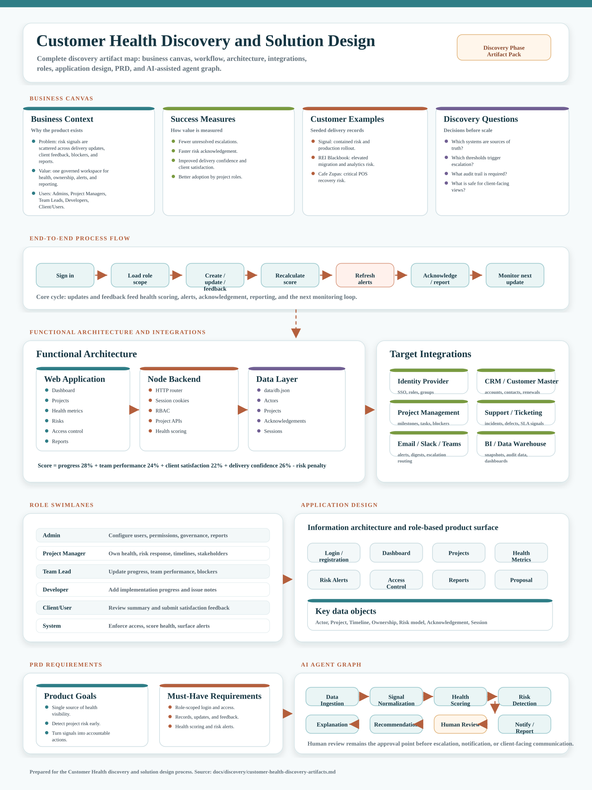

# Customer Health Master Diagram

This master diagram consolidates the discovery and solution design details for the Customer Health project into one visual artifact.

## Included Detail Areas

1. Business Canvas: business context, customer examples, success measures, and discovery questions.
2. Process Flow: sign-in through role scoping, updates, scoring, alerts, acknowledgement, reporting, and monitoring.
3. Functional Architecture: web app, Node backend, role access, health scoring, and data layer.
4. Integration Diagram: identity, CRM, project management, support/ticketing, communications, and BI/data warehouse.
5. Swimlane Diagram: Admin, Project Manager, Team Lead, Developer, Client/User, and System responsibilities.
6. Application Design: screens, modules, and key data objects.
7. PRD: product goals and must-have requirements.
8. Agent Graph: data ingestion, normalization, scoring, risk detection, explanation, recommendation, human review, and notification/reporting.
