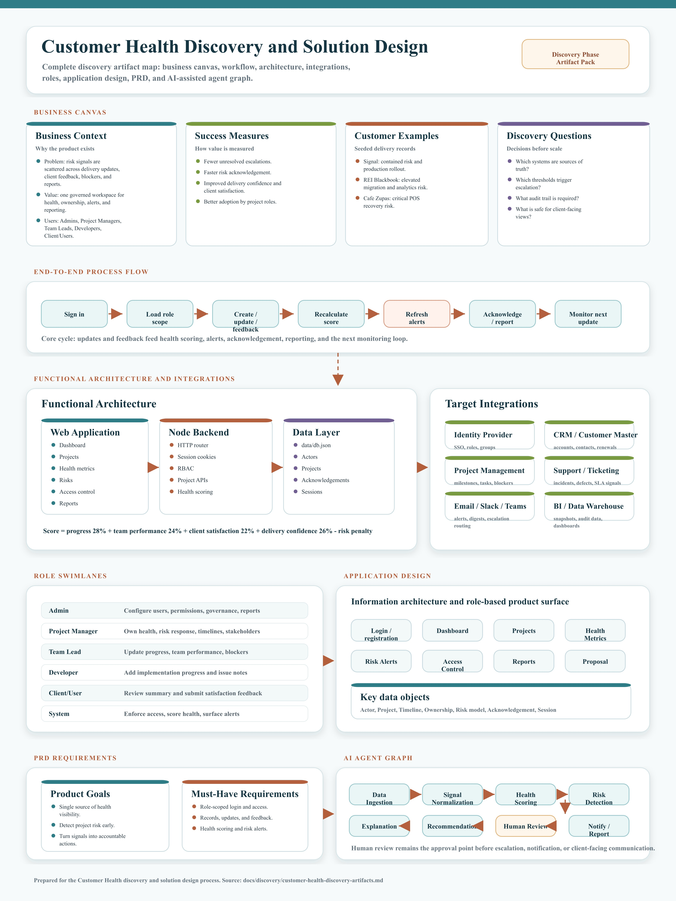

# Customer Health JPEG Diagrams

These JPEG files are generated from the Customer Health master discovery diagram for presentation, document, and email use.

| Diagram | JPEG |
| --- | --- |
| Full master diagram | [customer-health-master-diagram.jpg](customer-health-master-diagram.jpg) |
| Business Canvas | [customer-health-business-canvas.jpg](customer-health-business-canvas.jpg) |
| Process Flow | [customer-health-process-flow.jpg](customer-health-process-flow.jpg) |
| Functional Architecture | [customer-health-functional-architecture.jpg](customer-health-functional-architecture.jpg) |
| Integration Diagram | [customer-health-integration-diagram.jpg](customer-health-integration-diagram.jpg) |
| Swimlane Diagram | [customer-health-swimlane-diagram.jpg](customer-health-swimlane-diagram.jpg) |
| Application Design | [customer-health-application-design.jpg](customer-health-application-design.jpg) |
| PRD Requirements | [customer-health-prd-requirements.jpg](customer-health-prd-requirements.jpg) |
| Agent Graph | [customer-health-agent-graph.jpg](customer-health-agent-graph.jpg) |

## Preview

